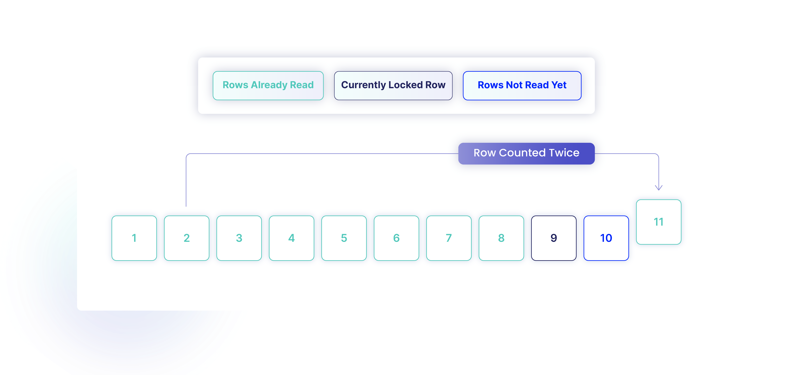
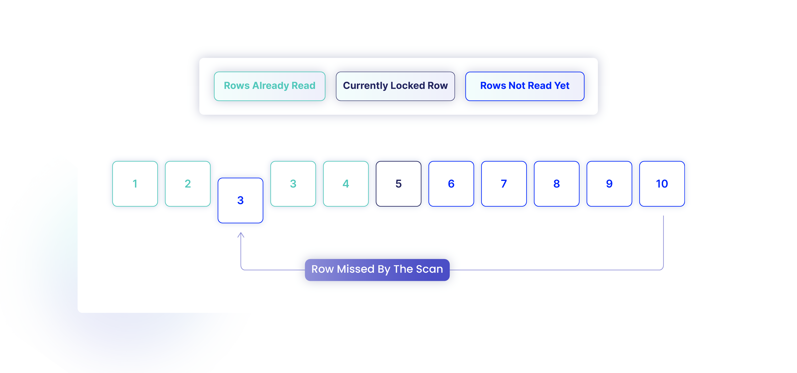

# Database Isolation Levels
From (https://www.metisdata.io/blog/transaction-isolation-levels-and-why-we-should-care)[https://www.metisdata.io/blog/transaction-isolation-levels-and-why-we-should-care]

## It’s all about the performance
SQL database cannot handle only one incoming connection at a time because it would be devastating for the performance of the system. We expect the database to accept many callers in parallel and execute their requests as fast as possible. It is rather clear how to do that when these callers ask for different data, i.e., first caller reads from Table 1 while second caller reads from Table 2. However, very often different callers want to read from and write to the same table. How should we handle these queries? What should be the order of operations and the final result? This is where a transaction isolation level comes into play.

A transaction is a set of queries (like SELECT, INSERT, UPDATE, DELETE) sent to the database to execute that should be completed as a unit of work. This means that they either need to be executed all, or none of them should be executed. It takes time to execute transactions. For instance, a single UPDATE statement may modify multiple rows. The database system needs to modify every row and this takes time. While performing an update, another transaction may begin and try to read the rows that are currently being modified. The question we may ask here is – should the other transaction read new values of rows (despite not all of them are already updated), old values of rows (despite some of them are already updated), or maybe should it wait? And what if the first transaction needs to be canceled later for any reason? What should happen to the other transaction?

Transaction isolation levels control how we determine the data integrity between transactions. They decide how transactions should be executed, when they should wait, and what anomalies are allowed to appear. We may want to allow for some anomalies to be theoretically possible to increase the performance of the system.

## Read phenomena
Depending on how we control concurrency in the database, different read phenomena may appear. The standard SQL 92 defines three read phenomena describing various issues that may happen when two transactions are executed concurrently with no transaction isolation in place.

We’ll use the following People table for the examples:

| Id  | Name | Salary |
|-----|------|--------|
| 1   | John | 150    |
| 2   | Jack | 200    |

### Dirty read

When two transactions access the same data and we allow for reading values that are not yet committed, we may get a dirty read. Let’s say that we have two transactions doing the following:

| Seq | Transaction 1                          | Transaction  2                              |
|-----|----------------------------------------|---------------------------------------------|
|  1  |                                        | UPDATE People SET salary = 180 WHERE id = 1 |
|  2  | SELECT salary FROM People WHERE id = 1 |                                             |
|  3  |                                        | ROLLBACK                                    |

Transaction 2 modifies row with id = 1, then Transaction 1 reads the row and gets value 180, and Transaction 2 rolls things back. Effectively, Transaction 1 uses value that doesn’t exist in the database. What we would expect here is that Transaction 1 uses values that were successfully committed in the database at some point in time.

### Repeatable read
Repeatable read is a problem when a transaction reads the same thing twice and gets different results each time. Let’s say the transactions do the following:

| Seq | Transaction 1                          | Transaction  2                              |
|-----|----------------------------------------|---------------------------------------------|
| 1   | SELECT salary FROM People WHERE id = 1 |                                             |
| 2   |                                        | UPDATE People SET salary = 180 WHERE id = 1 |
| 3   |                                        | COMMIT                                      |
| 4   | SELECT salary FROM People WHERE id = 1 |                                             |

Transaction 1 reads a row and gets value 150. Transaction 2 modifies the same row. Then Transaction 1 reads the row again and gets a different value (180 this time).

What we would expect here is to read the same value twice.

### Phantom read
Phantom read is a case when a transaction looks for rows the same way twice but gets different results. Let’s take the following:
Repeatable read is a problem when a transaction reads the same thing twice and gets different results each time. Let’s say the transactions do the following:

| Seq | Transaction 1                          | Transaction  2                                              |
|-----|----------------------------------------|-------------------------------------------------------------|
| 1   | SELECT * FROM People WHERE salary < 250|                                                             |
| 2   |                                        | INSERT INTO People(id, name, salary) VALUES (3, Jacob, 120) |
| 3   |                                        | COMMIT                                                      |
| 4   | SELECT * FROM People WHERE salary < 250|                                                             |

Transaction 1 reads rows and finds two of them matching the conditions. Transaction 2 adds another row that matches the conditions used by the Transaction 1. When the Transaction 1 reads again, it gets a different set of rows. We would expect to get the same rows for both SELECT statements of Transaction 1.

## Isolation Levels
SQL 92 standard defines various isolation levels that define which read phenomena can occur. There are 4 standard levels: READ UNCOMMITED, READ COMMITED, REPEATABLE READ, and SERIALIZABLE.

READ UNCOMMITED allows a transaction to read data that is not yet committed to the database. This allows for highest performance but it also leads to most undesired read phenomena.

READ COMMITED allows a transaction to read only data that is committed. This avoids issue of reading data that “later disappears” but doesn’t protect from other read phenomena.

REPEATABLE READ level tries to avoid issue of reading data twice and getting different results.

Finally, SERIALIZABLE tries to avoid all read phenomena.

The following table shows which phenomena are allowed:
The following table shows which phenomena are allowed:

| Level/Phenomena |Dirty read	| Repeatable read	| Phantom |
|-----------------|---|---|---------|
| READ UNCOMMITED |	+|	+|	+  |
| READ COMMITED	  |-	|+|	+ |    |
| REPEATABLE READ |	|-|	-|	+ |
| SERIALIZABLE	   |-	|-|	- |    |

The isolation level is defined per transaction. For example, it’s allowed for one transaction to run with SERIALIZALBLE level, and for another to run with READ UNCOMMITED.

## How does it work under the hood
The database needs to implement mechanisms guaranteeing lack of specific read phenomena. There are generally two broad approaches to solving these: pessimistic locking and optimistic locking.

### Pessimistic locking
First approach is called pessimistic locking. In this approach we want to avoid issues by making sure a transaction doesn’t introduce problematic changes. We do that by locking specific parts of the database. When a given part is locked by one transaction, then another transaction cannot read or write data according to the transaction isolation level to avoid issues.

There are various levels of locks in the database: they can be stored on a row level, page level (which we can consider a group of rows for the purpose of this article), table level, and whole database level. There are also various types of locks: locks for reading, for writing, locks that can be shared between transactions or not, locks for intent, and so on. This article focuses on SQL databases in general, so we won’t go into details of actual implementations.

Conceptually, to avoid a given read phenomena, a transaction needs to lock specific parts of the database in a way that guarantee that other transactions will not introduce changes leading to a specific type of read phenomena. For instance, to avoid dirty reads, we need to lock all modified or read rows so that other transactions cannot read nor modify them.

There are multiple advantages of this approach. First, it allows for fine granularity in terms of what can be modified and which transactions can safely carry on. Second, it scales well and imposes low overhead when there are multiple transactions working on different data. Third, transactions don’t need to roll things back.

However, this can decrease the performance significantly. For instance, if two transactions want to read and modify data in the same table, and both of these transactions operate on SERIALIZABLE level, then they’ll need to wait for each other to complete. Even if they touch different rows from the table.

Most database management systems use this way. For instance, MS SQL uses this for its 4 main isolation levels.

### Optimistic locking
Another approach is called optimistic locking. This approach is also known as snapshot isolation or Multiversion Concurrency Control (MVCC for short). Each entity in the table has associated version number with it. When we modify a row, we also increase its row version, so other transactions can observe that it changed.

When a transaction starts, it records the version number so it knows what is the state of the rows. When it reads from a table, it only extracts rows that were modified before the transaction was started. Next, when the transaction modifies the data and tries to commit them to the database, the database verifies row versions. If rows were modified in the meantime by some other transaction, the update is now rejected and the transaction has to start from scratch.

This approach works well in a case when transactions touch different rows because then they can commit with no issues. This allows for better scaling and higher performance because transactions don’t need to take locks. However, when transactions often modify the same rows, some of the transactions will need to be rolled back often. This leads to a performance degradation. Another disadvantage is a need to keep the row versions. This increases the complexity of the database system.
Various database management systems use this approach. For instance, Oracle or MS SQL with snapshots enabled.

## Practical considerations
While isolation levels seem to be well defined, there are various little details that affect how the database systems work under the hood. Let’s see some of them.

### Isolation levels are not mandatory
While the SQL 92 standard defines multiple isolation levels, they are not mandatory. This means that all levels in a given database management system can be implemented as SERIALIZABLE. We use other isolation levels to increase the performance, but it’s not enforced in any way. This means that if we rely on a particular optimization happening in one database management system, the same optimization may not be used in another database management system. We shouldn’t rely on implementation details, but stick to the standard instead.

### Default isolation level is not standardized
The default isolation level is configured per transaction. This is typically dictated by the library or connectivity technology you use to connect to the database. Depending on your default settings, you may operate on a different isolation level and this may lead to different results or different performance. Typical libraries use SERIALIZABLE or READ COMMITED level.

### Problems with READ COMMITED
While READ COMMITED guarantees a transaction reads only committed data, it doesn’t guarantee that the data it reads is the latest one. It is possible that it reads a value that was committed at some point in the past, but was overridden later on by another transaction.

There is another issue with READ COMMITED level. Due to how entities are stored under the hood, it is possible that a transaction reads particular row twice or skips it. Let’s see why.

Typical database management system stores rows in a table in an ordered fashion, typically using primary key of the table in a B-tree. This is because the primary key typically imposes a clustered index which causes the data to be physically ordered on a disk. Let’s now assume that there are 10 rows with ids from 1 to 10. Let’s say our transaction read 8 rows already so rows with ids from 1 to 8 inclusive. Now, if another transaction modified the row with id = 2 and changes the id value to 11 (and commits), we’ll then continue scanning and find 11 rows in total. What’s more, we’ll read the row with id = 2 but the row doesn’t exist anymore!

                     
Based on the same idea, we can miss a row. Let’s say that we have 10 rows in total, and we already read rows from 1 to 4. Next, another transaction changes the row with id = 10 and sets its id to 3. We won’t find this row due to the ordering.

### White and black marbles problem
We mentioned two different ways of implementing locks. Pessimistic locking locks rows and disallows other transactions to modify them when they’re locked. Optimistic locking stores row versions and allows other transactions to move on as long as they work on latest data.

There is another issue with SERIALIZABLE level when it’s implemented with optimistic locking that is known as white and black marbles problem. Let’s take the following Marbles table:

| id | color  | row_version |
|----|--------|-------------|
| 1  | black  | 1           |
| 2  | white  | 1           |

Let’s now say that we want to run two transactions. First tries to change all black stones into white. Another one tries to do the opposite – it tries to change all whites into blacks. We have the following:

| Transaction 1                                           | 	Transaction 2                                         |
|---------------------------------------------------------|----------------------------------------------------------|
| UPDATE Marbles SET color = 'white' WHERE color = 'black'| UPDATE Marbles SET color = 'black' WHERE color = 'white' |

Now, if we implement SERIALIZABLE with pessimistic locking, a typical implementation will lock the entire table. After running both of the transactions we end with either two black marbles (if first we execute Transaction 1 and then Transaction 2) or two white marbles (if we execute Transaction 2 and then Transaction 1).

However, if we use optimistic locking, we’ll end up with the following:

| id | color | row_version |
|----|-------|-------------|
| 1  | white | 2           |
| 2  | black | 2           |

Since both transactions touch different set of rows, they can run in parallel. This leads to an unexpected result.

## Summary
In this article we have seen what transaction isolation levels are and how they allow for different read phenomena. We also learned how they are conceptually implemented by the database systems, and how they can lead to unexpected results.
